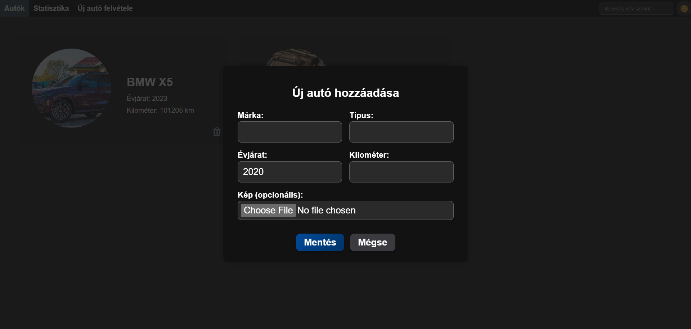
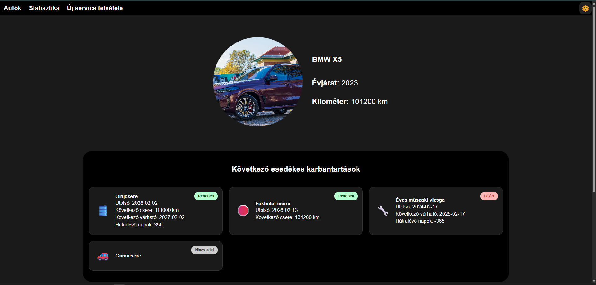
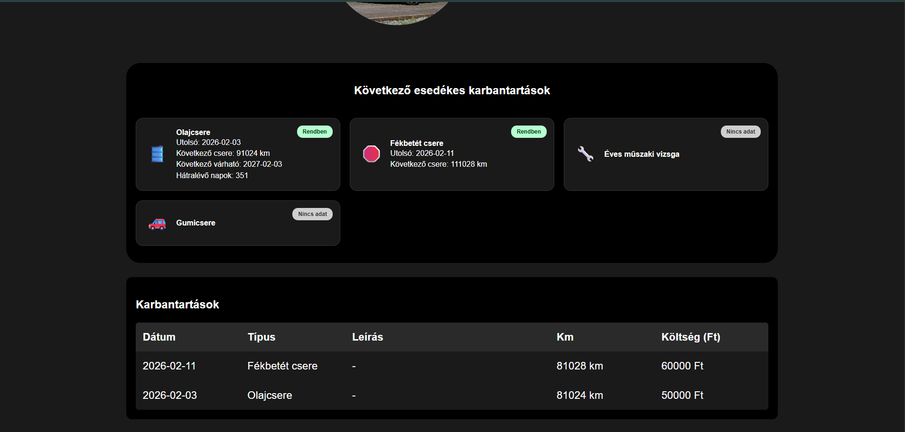
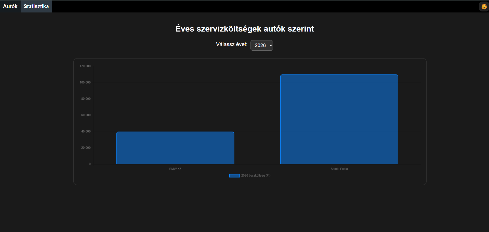
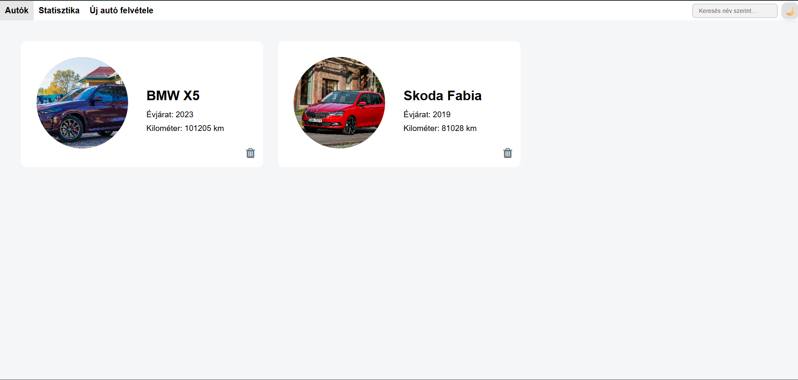

# Car Maintenance Manager

A React-based web application for tracking and managing vehicle maintenance, service history, and yearly costs.

---

## Description

Car Maintenance Manager is a modern, responsive web application that helps users keep track of their vehicles' maintenance and expenses. The app allows managing multiple cars, recording service history, and automatically calculating upcoming maintenance events.

All data is stored in the browser using LocalStorage, so users can safely close the application without losing their data.

---

## Features

### Vehicle Management

- Add and manage multiple vehicles
- Store vehicle details:
  - Brand
  - Model
  - Year
  - Mileage
  - Optional image
- Easily switch between vehicles




### Service Log

Each vehicle has its own dedicated service history where users can:

- Record repairs
- Add replaced parts
- Save service dates
- Track different types of maintenance





### Automatic Maintenance Reminders

- Automatically calculates upcoming maintenance events (e.g. oil change, brake pad replacement, annual inspection)
- Displays alerts when a maintenance deadline is approaching

### Statistics Page

- Displays yearly maintenance costs
- Visual comparison between vehicles
- Graph-based overview of expenses



### UI / UX

- Clean and modern responsive design
- Dark / Light mode support
- Mobile-friendly layout



---

## Tech Stack

- React
- TypeScript
- LocalStorage API
- CSS / Responsive Design

---

## Installation & Setup

Clone the repository:

```bash
git clone https://github.com/zelchcsaba/Car-maintenance.git
cd Car-maintenance
Install dependencies:

npm install
Start the development server:

npm start
The application will run at:

http://localhost:5173
